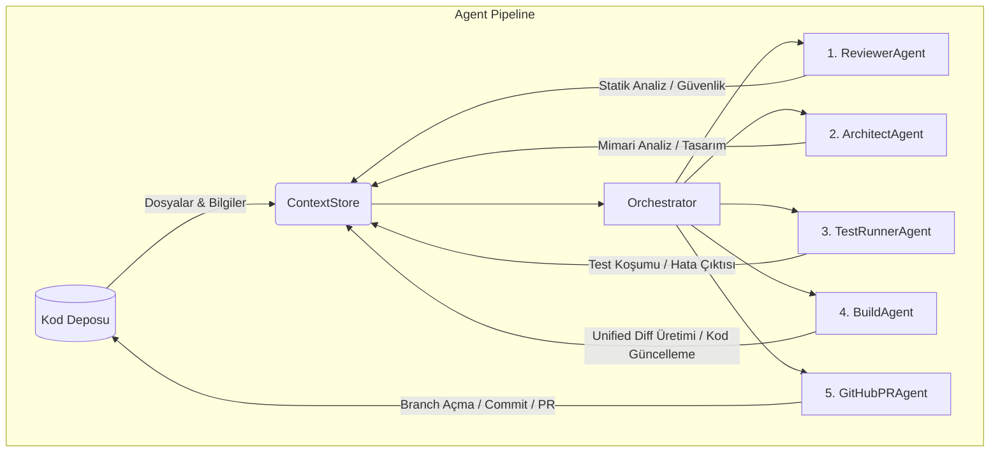

# multiagent

`multiagent`, Python 3.11+ ile geliştirilecek multi-agent kod analiz aracı için başlangıç iskeletidir.

Amaç, farklı ajanların orkestrasyonunu, LLM entegrasyonlarını, MCP bağlantılarını, araçları ve bağlam yönetimini temiz paket sınırlarıyla geliştirmeye uygun bir temel sağlamaktır.

## Özellikler

- **5 Farklı Agent Pipeline'ı:** Projedeki sorunları adım adım tespit eden, çözüm üreten ve kod tabanına uygulayan özelleştirilmiş 5 ajandan oluşan zincir (Reviewer, Architect, Test-runner, Build, GitHub-PR).
- **Yerel LLM Desteği:** Ollama gibi yerel modeller (ör. Qwen, Gemma) ile gizlilik odaklı ve hızlı çevrimdışı kod analizi.
- **MCP (Model Context Protocol) Desteği:** Harici statik analiz araçlarını (sunucularını) dinamik olarak keşfedip kullanma. Araç bulunamazsa akıllı şekilde LLM/Yerel tabanlı analize geri dönme (fallback) yeteneği.
- **Otomatik Pull Request:** Çözüm önerilerini (Unified Diff) otomatik olarak GitHub üzerinden bir Pull Request'e dönüştürme ve dry_run modlarıyla güvenli test imkanı.

## Mimari ve Agent Akış Diyagramı

Aşağıdaki diyagramda `multiagent` projesinin nasıl çalıştığı, ajanların `ContextStore` üzerinden nasıl haberleştiği ve uçtan uca akışı gösterilmektedir:



*(Her agent sırayla çalışarak `ContextStore` üzerinde bulgular (findings) ve kararlar (decisions) biriktirir.)*

## Kurulum

```bash
python -m venv .venv
source .venv/bin/activate
pip install -e ".[dev]"
```

Windows PowerShell:

```powershell
python -m venv .venv
.\.venv\Scripts\Activate.ps1
pip install -e ".[dev]"
```

Ollama'nın yerelde çalıştığından ve kullanmak istediğiniz modelin indirildiğinden emin olun:

```bash
ollama pull qwen2.5-coder
```

## Kullanım

### CLI Bayrakları ve Açıklamaları

Aşağıdaki tabloda `multiagent analyze` komutuna verebileceğiniz temel konfigürasyon seçenekleri listelenmiştir:

| Bayrak | Açıklama | Örnek |
| --- | --- | --- |
| `--model` | Kullanılacak yerel LLM modelinin adı. Ortam değişkeninden (`MULTIAGENT_MODEL`) önceliklidir. | `--model gemma2` |
| `--agents` | Çalıştırılacak ajanların adlarını virgülle ayırarak seçmenizi sağlar. Belirtilmezse varsayılan liste çalışır. | `--agents reviewer,build` |
| `--apply` | BuildAgent'ın ürettiği unified diff'i repo üzerindeki dosyalara kalıcı olarak uygular. | `--apply` |
| `--open-pr` | Zincire `GitHubPRAgent`'i dahil eder. Aksi belirtilmedikçe (execute-pr yoksa) sadece dry-run yapar, log atar. | `--open-pr` |
| `--execute-pr` | GitHubPRAgent'ın dry-run modunu kapatarak **gerçek** bir GitHub PR açmasını sağlar. | `--execute-pr` |
| `--require-mcp` | MCP sunucusunun bulunmasını veya çalışmasını zorunlu kılar. MCP arızalanırsa süreç hata fırlatarak durur. | `--require-mcp` |
| `--mcp-command` | MCP (stdio tabanlı) sunucusunu başlatacak komut (ör. `node`, `python`). | `--mcp-command "node"` |
| `--mcp-args` | Başlatılan MCP sunucusuna gönderilecek argümanlar. Boşlukla ayrılır. | `--mcp-args "server.js"` |
| `--mcp-url` | Eğer MCP sunucusu SSE tabanlı veya HTTP arkasındaysa bağlantı kurulacak URL. | `--mcp-url "http://localhost:8000/sse"` |

### Uçtan Uca Çalıştırma (End-to-End)

Tüm zinciri uçtan uca çalıştırmak, otomatik olarak diff uygulayıp GitHub üzerinde Pull Request (PR) açmak için:

```bash
export GITHUB_TOKEN="ghp_xxx_sizin_tokeniniz_xxx"
multiagent analyze . \
    --apply \
    --open-pr \
    --execute-pr
```

### GITHUB_TOKEN Kullanımı

Eğer `GitHubPRAgent`'in gerçek bir PR açmasını (veya salt-okunur dry-run senaryosunda yetki hatası almasını engellemek) isterseniz, GitHub ortam değişkeni olarak `GITHUB_TOKEN` belirtmelisiniz:

```bash
export GITHUB_TOKEN="ghp_xxxxxx"
multiagent analyze . --open-pr
```

### MCP (Model Context Protocol) Yapılandırması

Agent'lar, sunulan MCP (Model Context Protocol) araçlarını kullanarak dış analizler (statik analiz, test vs.) yapabilirler. Örnek bir Node tabanlı MCP sunucusuna (`stdio` ile) bağlanmak için:

```bash
multiagent analyze . \
    --mcp-command "node" \
    --mcp-args "path/to/mcp/server.js"
```

Eğer MCP sunucusuna SSE üzerinden bağlanacaksanız:

```bash
multiagent analyze . \
    --mcp-url "http://localhost:8000/sse"
```

## Geliştirme ve Test

```bash
ruff check .
ruff format .
mypy src tests
pytest
```

## Katkı

Katkı göndermeden önce kalite kontrollerini çalıştırın:

```bash
ruff check .
ruff format --check .
mypy src tests
pytest
```

Yeni agent veya gateway davranışı eklerken ilgili birim testlerini de ekleyin. `mypy` CI'da bloklayıcıdır, bu yüzden public API'lerde ve test yardımcılarında tip ipuçlarını eksiksiz tutun.
