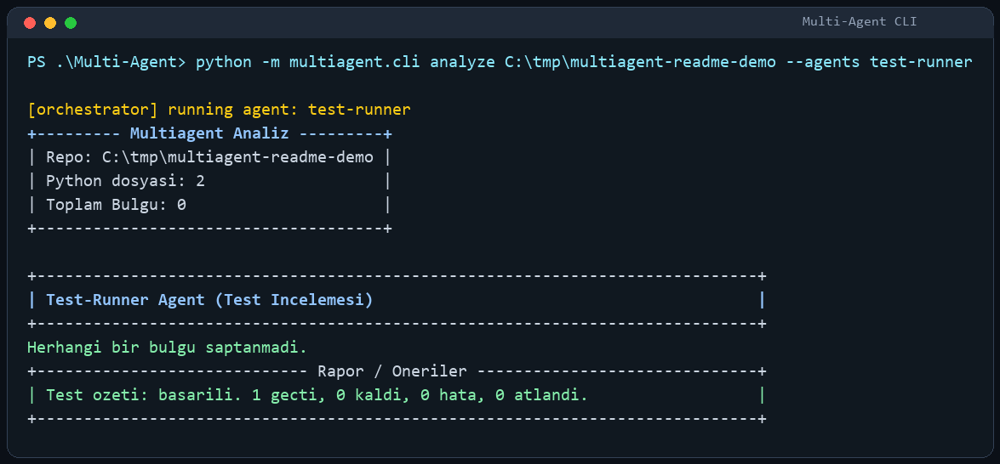
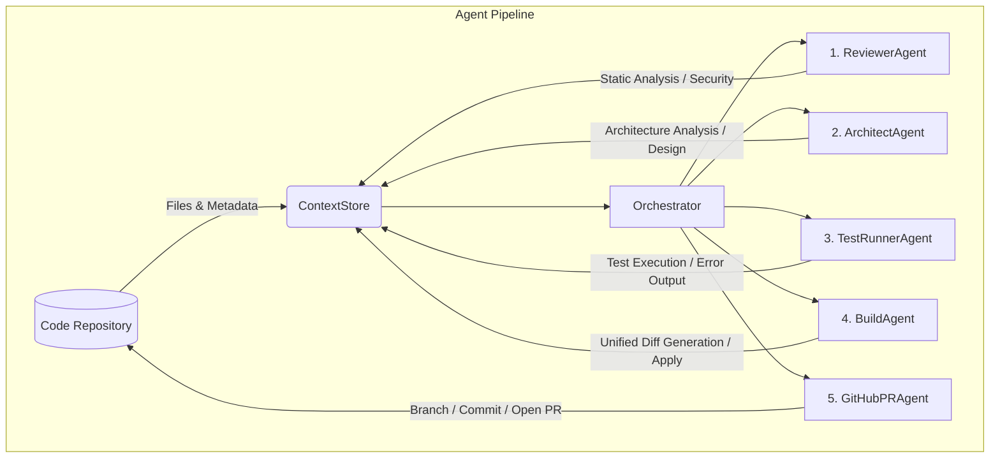

<h1 align="center">MULTI-AGENT</h1>

<p align="center">
  
  
  
  
</p>

<p align="center">
  
</p>

Project Status: **Active / Beta**. 

This project is an intelligent multi-agent code analysis and automated Pull Request creation tool developed with Python 3.11+. It seamlessly orchestrates specialized agents (Reviewer, Architect, TestRunner, Build, GitHubPR) to scan your codebase, propose architecture improvements, validate tests, and open GitHub Pull Requests autonomously using the Model Context Protocol (MCP) and LLM integrations.

<h2 align="center">Showcase</h2>

> **Turkish Summary:** Bu proje bir multi-agent kod analiz ve otomatik PR aracidir. Terminal uzerinde renkli ve etkilesimli bir deneyim sunar.

### Completed Features

- [x] **5-Agent Pipeline:** Reviewer, Architect, Test-Runner, Build, and GitHub-PR agents working in harmony.
- [x] **Local & Remote LLMs:** Out-of-the-box support for local Ollama models (Qwen, Gemma) AND OpenAI-compatible endpoints (OpenAI, Kimi, DeepSeek, etc.).
- [x] **MCP Integration:** Dynamically connects to external tools (stdio or SSE) with fallback mechanisms.
- [x] **Automated Pull Requests:** Generates unified diffs and automatically opens PRs on GitHub with rich descriptions.
- [x] **Robust Configuration:** Managed via `pyproject.toml` and `.multiagent.toml`.

<h2 align="center">Features</h2>

- **5 Distinct Agent Pipelines:** A specialized chain of 5 agents (Reviewer, Architect, Test-runner, Build, GitHub-PR) that step-by-step identifies issues, produces solutions, and applies them to the codebase.
- **Local LLM Support:** Privacy-focused, offline, and fast code analysis using local models (e.g., Qwen, Gemma) powered by Ollama.
- **MCP (Model Context Protocol) Support:** Dynamically discovers and utilizes external static analysis tools or test servers. Features an intelligent fallback mechanism to local LLM-based analysis if the external tool is unavailable.
- **Automated Pull Requests:** Automatically transforms proposed solutions (Unified Diff) into a GitHub Pull Request with a descriptive LLM-generated title and body. Includes a safe `dry_run` mode for testing.
- **v0.2 Platform Mode:** Adds persistent SQLite memory, deterministic coordinator routing, dedicated security scanning, AST-based repo knowledge graphs, and multi-model benchmark scoring.

<h2 align="center">Architecture and Agent Flow Diagram</h2>

The diagram below illustrates how the `multiagent` project operates, how agents communicate via the `ContextStore`, and the end-to-end flow:



*(Each agent runs sequentially, accumulating findings and decisions in the ContextStore.)*

## Installation

```bash
python -m venv .venv
source .venv/bin/activate
pip install -e ".[mcp,dev]"
```

Windows PowerShell:

```powershell
python -m venv .venv
.\.venv\Scripts\Activate.ps1
pip install -e ".[mcp,dev]"
```

Make sure Ollama is running locally and the target model is pulled:

```bash
ollama pull qwen2.5-coder
```

## Usage

### CLI Flags and Descriptions

The following table lists the core configuration options available for the `multiagent analyze` command:

| Flag | Description | Example |
| --- | --- | --- |
| `--model` | Name of the local LLM to use. Overrides the `MULTIAGENT_MODEL` environment variable. | `--model gemma2` |
| `--agents` | Comma-separated list of agents to run. Runs the default pipeline if not specified. | `--agents reviewer,build` |
| `--apply` | Permanently applies the unified diff generated by the BuildAgent to the repository files. | `--apply` |
| `--open-pr` | Appends `GitHubPRAgent` to the pipeline. Performs a dry-run and logs output unless `--execute-pr` is provided. | `--open-pr` |
| `--execute-pr` | Disables the dry-run mode of GitHubPRAgent and opens an **actual** GitHub Pull Request. | `--execute-pr` |
| `--require-mcp` | Forces the system to require an MCP server. Aborts with a hard error if the MCP server fails. | `--require-mcp` |
| `--mcp-command` | Command to start the MCP (stdio-based) server (e.g., `node`, `python`). | `--mcp-command "node"` |
| `--mcp-args` | Arguments to pass to the MCP stdio server, separated by spaces. | `--mcp-args "server.js"` |
| `--mcp-url` | URL to connect to if the MCP server is operating over SSE/HTTP. | `--mcp-url "http://localhost:8000/sse"` |
| `--coordinator` | Uses CoordinatorAgent to decide which agents run, skip, or rerun. | `--coordinator` |
| `--task` | Describes the current task for memory, coordinator, and benchmark flows. | `--task "harden authentication"` |
| `--memory` | Enables persistent SQLite memory at `.multiagent/memory.sqlite` by default. | `--memory` |
| `--security` | Runs SecurityAgent checks for secrets, SQLi, SSRF, XSS, and dependency audit status. | `--security` |
| `--knowledge-graph` | Builds an AST-based repo graph used by ArchitectAgent and BuildAgent. | `--knowledge-graph` |

### Platform Mode

Run the autonomous secure engineering flow with coordinator routing, memory, security, and graph context:

```bash
multiagent analyze . \
    --coordinator \
    --memory \
    --security \
    --knowledge-graph \
    --task "harden authentication and tests"
```

Benchmark multiple model adapters on the same task without mutating the real repository:

```bash
multiagent benchmark . \
    --task "fix failing tests" \
    --models qwen,deepseek,gemini \
    --json-out benchmark.json
```

### End-to-End Execution

To run the complete pipeline end-to-end, automatically apply the diff, and open a Pull Request on GitHub:

```bash
export GITHUB_TOKEN="ghp_xxx_your_token_xxx"
multiagent analyze . \
    --apply \
    --open-pr \
    --execute-pr
```

### GITHUB_TOKEN Usage

If you want `GitHubPRAgent` to open a real PR (or to prevent permission errors during a read-only dry-run), you must provide your GitHub token via the `GITHUB_TOKEN` environment variable:

```bash
export GITHUB_TOKEN="ghp_xxxxxx"
multiagent analyze . --open-pr
```

### MCP (Model Context Protocol) Configuration

Agents can leverage external analysis tools (static analysis, testing, etc.) provided by an MCP server. To connect to an example Node-based MCP server via `stdio`:

```bash
multiagent analyze . \
    --mcp-command "node" \
    --mcp-args "path/to/mcp/server.js"
```

If you are connecting to an MCP server via SSE:

```bash
multiagent analyze . \
    --mcp-url "http://localhost:8000/sse"
```

## Development and Testing

```bash
ruff check .
ruff format .
mypy src tests
pytest
```

## Contribution

Please refer to [CONTRIBUTING.md](CONTRIBUTING.md) for detailed guidelines on how to contribute to this project.
