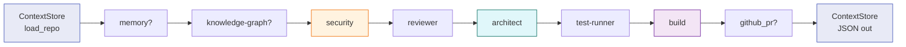

# Architecture

`Multi-Agent` üç ana yapı taşı üzerine kuruludur:

1. **`ContextStore`** — ajanlar arasında akan tek paylaşımlı nesne.
2. **Ajanlar** — `BaseAgent.run(context)` sözleşmesine uyan saf Python
   sınıfları.
3. **`Orchestrator`** — ajanları sırayla (veya `CoordinatorAgent` ile
   dinamik olarak) çalıştırır.

## Pipeline akışı



Ajanlar aynı `ContextStore` nesnesini paylaşır ve her biri onu mutasyona
uğratarak bir sonrakine geçirir. Orchestrator (`orchestrator/core.py`)
sıralı bir `for agent in self.agents` döngüsü ile ajanları çağırır;
hata olursa `fail_fast` politikasına göre ya durur ya `agent_trace`'e
kayıt düşer ve devam eder.

## ContextStore alanları

`ContextStore` bir `@dataclass`'tır (frozen değildir; ajanlar onu
mutasyona uğratır):

| Alan                | Tür                                   | Açıklama                                          |
| ------------------- | ------------------------------------- | ------------------------------------------------- |
| `repo_path`         | `Path`                                | Analiz edilen repo kökü                          |
| `task`              | `str`                                 | Görev niyeti (memory / coordinator tarafından okunur) |
| `run_id`            | `str`                                 | Tekil çalıştırma kimliği (ms timestamp + uuid kısa) |
| `files`             | `dict[str, str]`                      | `relative_path -> source text`                    |
| `findings`          | `list[Finding]`                       | Tüm ajanların eklediği bulgular                  |
| `decisions`         | `list[str]`                           | Ajanların serbest-metin karar günlükleri        |
| `memories`          | `list[MemoryRecord]`                  | Kalıcı hafıza kayıtları                          |
| `agent_trace`       | `list[AgentTrace]`                    | Her ajan için `start/success/error` olayı        |
| `knowledge_graph`   | `RepoGraph | None`                    | Dosya/sınıf/fonksiyon/içe-aktarım grafiği         |
| `benchmark_results` | `list[BenchmarkResult]`               | Çoklu-model benchmark skorları                   |
| `proposed_diffs`    | `list[DiffProposal]`                  | BuildAgent'in önerdiği unified-diff metinleri     |
| `exclude_dirs`      | `set[str]`                            | `load_repo` sırasında atlanan klasör adları (default: `.venv`, `node_modules`, `.git`) |
| `ast_trees`         | `dict[str, ast.Module | None]`        | **Paylaşımlı parse cache** (aşağıya bakın)       |

### Paylaşımlı AST cache

`ContextStore.get_ast(relative_path)` her dosya için tam olarak **bir kez**
`ast.parse` çağırır; sonraki çağrılar aynı `ast.Module` nesnesini
döndürür. Bu, AST kullanan üç ajanın (`architect`, `knowledge-graph`,
`security`) birbirinin parse maliyetini paylaşmasını sağlar:

```python
# Her ajan aynı helper'ı çağırır
tree = context.get_ast(relative_path)
if tree is None:
    return  # SyntaxError — cache None olarak tutulur
```

Önemli özellikler:

- **Serileştirme güvenli:** `ast_trees` alanı `to_json()` çıktısına
  yazılmaz (`ContextStore.to_json` manuel dict kullanır) ve `load()`
  sırasında default'a geri döner.
- **Eşitlik/yazdırma güvenli:** alan `compare=False, repr=False` ile
  işaretlidir → `__eq__` ve `__repr__` AST'yi karşılaştırmaz.
- **SyntaxError yönetimi:** parse başarısızsa `None` döner ve `None`
  olarak önbelleğe alınır — sonraki çağrılar yeniden parse denemez.

## Ajan sözleşmesi

```python
from multiagent.agents.base import Agent
from multiagent.context.store import ContextStore

class MyAgent(Agent):
    @property
    def name(self) -> str: ...           # "my-agent"
    def run(self, context: ContextStore) -> ContextStore:
        # ... context'i oku / yaz ...
        return context                    # Orchestrator için sözleşme
```

Ajanlar LLM çağrısı yapabilir ama yapmak zorunda değildir. LLM çağrısı
`LLMGateway.from_env()` üzerinden geçer; bu sınıf Ollama ve OpenAI-uyumlu
HTTP uçlarını destekler.

## Hata yönetimi

`Orchestrator(fail_fast=True | False)`:

- `fail_fast=True` (varsayılan): ilk `AgentError` ya da beklenmeyen
  istisna, `AgentError`'a sarılıp yeniden fırlatılır.
- `fail_fast=False`: ajan hatası `context.agent_trace`'e kaydedilir ve
  sonraki ajana geçilir.

`SecurityAgent` gibi bazı ajanlar kendi içlerinde `try/except` ile
**hata-kaydetme-yok-etme** politikası izler (Bandit kurulu değilse düşük
öncelikli `Finding` ekler).

## Kalıcı hafıza

`MemoryAgent`, `SQLiteMemoryStore` üzerinden yapılandırılmış kayıtları
`.multiagent/memory.sqlite` altında saklar. Bir sonraki çalıştırma
`--memory` flag'i ile bu kayıtları `ContextStore.memories` listesine
geri yükler. Schema ve sorgu detayı için
[`memory` ajanının](agents.md) sayfasına bakın.
